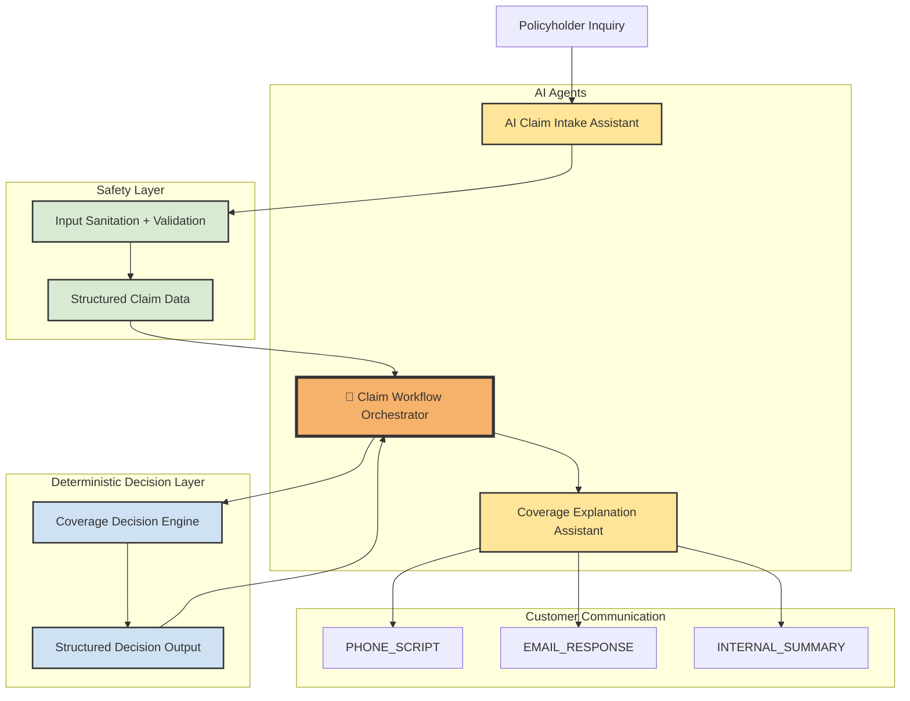

# 🚦 AI Claim Workflow Orchestrator

An AI workflow agent that routes insurance claim cases through intake, validation, decision, and communication systems.

This system determines **what happens next in the claim process** based on structured claim data.

## Multi-Agent System Overview

This project is part of a multi-agent AI workflow for handling insurance claim inquiries.

The system separates **data intake, safety controls, workflow routing, deterministic decisions, and customer communication**.



## Example Workflow Decisions

```
missing_information → request documents

likely_covered → route to claim submission

uncertain → escalate to specialist

denied → generate explanation
```

---

## Related Projects

This orchestrator connects two other AI workflow agents:

- **AI Claim Intake Assistant** → collects and sanitizes claim information  
- **Coverage Explanation Assistant** → converts structured decisions into customer explanations
