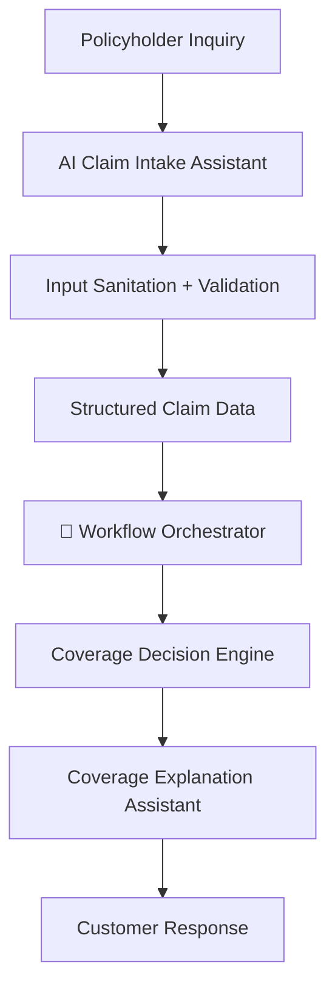

# 🚦 AI Claim Workflow Orchestrator

An AI workflow agent that routes insurance claim cases through intake, validation, decision, and communication systems.

This system determines **what happens next in the claim process** based on structured claim data.

---

## System Role

The Workflow Orchestrator evaluates the current claim state and decides the next workflow action.

Examples:

- request missing information
- route to coverage decision engine
- escalate to specialist review
- generate customer explanation

---

## Architecture Overview



---

## Example Workflow Decisions

```
missing_information → request documents

likely_covered → route to claim submission

uncertain → escalate to specialist

denied → generate explanation
```

---

## Related Projects

This orchestrator connects two other AI workflow agents:

- **AI Claim Intake Assistant** → collects and sanitizes claim information  
- **Coverage Explanation Assistant** → converts structured decisions into customer explanations
